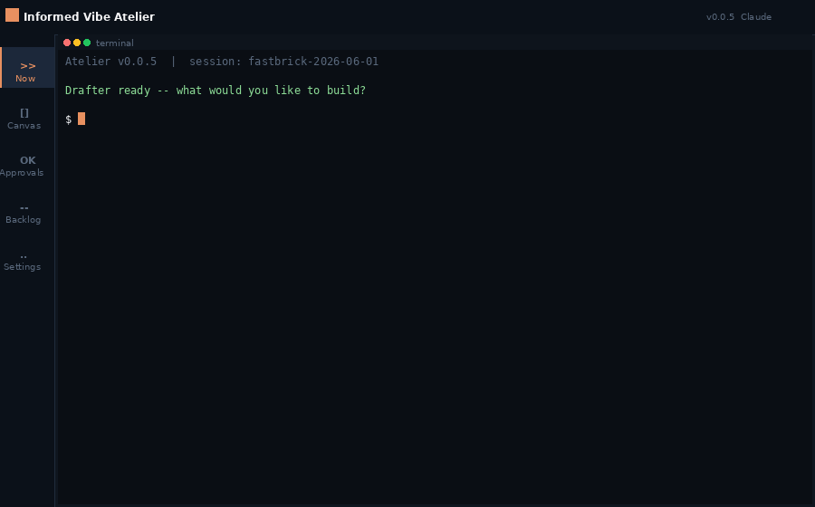
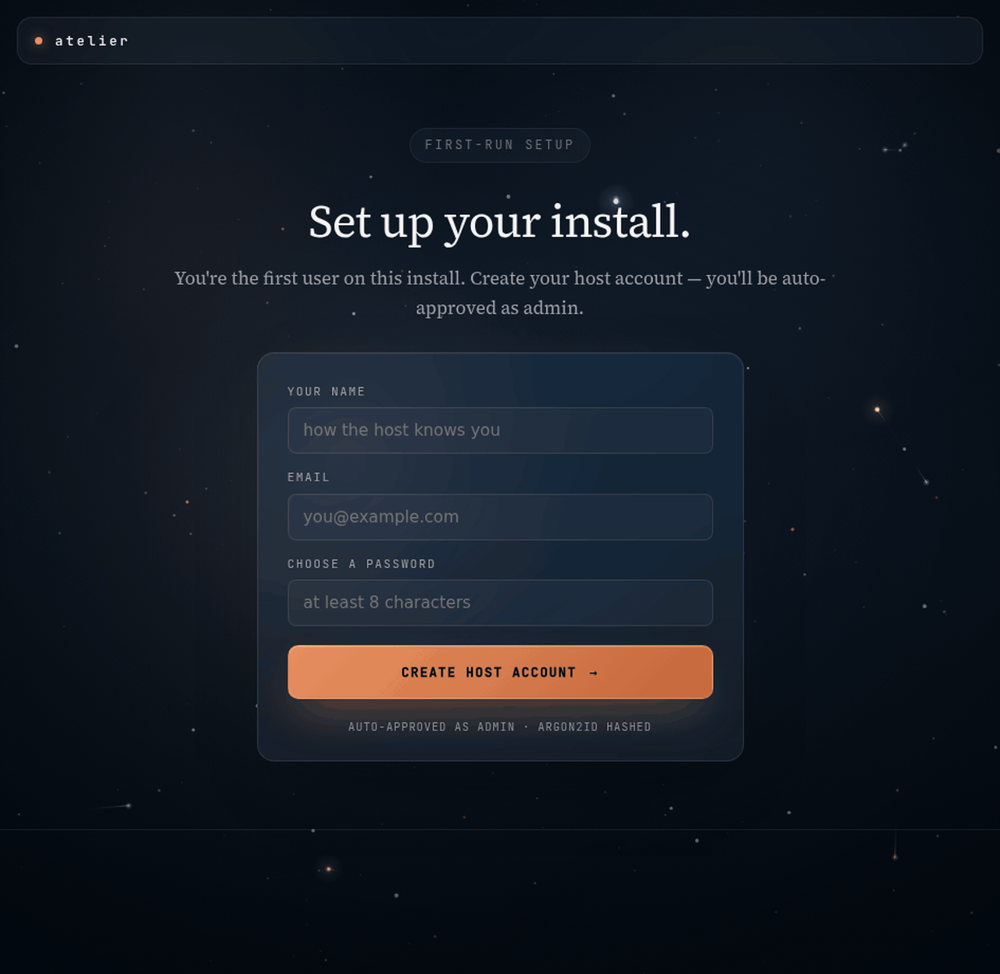

<div align="center">

# Informed Vibe Atelier

**An AI working environment, for the founder/builders who want to actually ship.**

*Vibe code with a brain. Ship with discipline. Bring your own provider.*

[Install](#install-in-five-minutes) · [What you can build](#what-you-can-ship-with-it) · [The UI](#the-surfaces) · [OmniGraph](#omnigraph--your-personal-brain) · [Roadmap](#roadmap)

</div>

<p align="center">
  
</p>

> _Synthetic preview — vague ask → Canvas decompose → approve → build. Replace with a live recording once WSLg/display is available._

<p align="center">
  
</p>

> *Above: a fresh `git clone` to a working canvas in under five minutes. No host, no cloud, no waitlist.*

---

## Why this exists

> *"The hottest new programming language is English."* — Andrej Karpathy

> *"There's a new kind of coding I call vibe coding, where you fully give in to the vibes, embrace exponentials, and forget that the code even exists."* — [@karpathy, Feb 2025](https://x.com/karpathy)

> *"Given the latest lift in LLM coding capability, like many others I rapidly went from about 80% manual+autocomplete coding and 20% agents in November to 80% agent coding and 20% edits+touchups."* — [@karpathy, Jan 27 2026](https://x.com/karpathy/status/1884070066678403110)

The shift Karpathy describes is the one most builders are quietly experiencing right now. It happens fast. It feels great. And then most projects die in *"almost done"* purgatory.

The first weekend feels magical. The codebase is small, every ask maps to the whole project, the AI keeps up. By week three the codebase has grown past one context window of clarity. Your asks become vague — *"fix my chat"*, *"the page is broken"* — because you can't hold every component in your head at once. The AI guesses. Regressions appear. Trust erodes. You re-prompt with even less context because you're frustrated. The project dies in *"almost done"* purgatory.

The middle ground between over-trusting AI and under-trusting it — *informed, controlled, effective collaboration* — is almost entirely uncharted for most people.

**Informed Vibe Atelier is the demonstration that this middle ground exists and is buildable.**

---

## What it is

A working environment for small founding teams where an AI co-founder receives direction from both technical and non-technical founders, works autonomously between sessions, and gives each person the right level of visibility and control.

It is **not** another agent framework. **Not** another AI coding assistant. **Not** another startup OS.

**Why not just run `claude` (or Gemini, Cursor, etc.) in a terminal?** Because Atelier makes the AI *ask for approval before building anything*. Every vague ask is decomposed into specific Canvas plan-nodes — intent sentence + acceptance criteria — and **nothing runs until you greenlight a node**. The agent works autonomously between your sessions, but only against scope you explicitly approved. That single gate is what keeps projects from dying in "almost done" purgatory.

It is:

- A **control plane** for an autonomous AI agent that thinks like a founder
- Powered by **domain intelligence** — the agent knows your industry before writing code
- Powered by **codebase intelligence** — the agent knows your codebase deeply, including what changes ripple where
- Accessible to **both technical and non-technical founders** through role-aware views
- **Local-first.** No cloud, no telemetry, no account, no lock-in
- **Bring your own model.** Claude, Qwen-Code (free, local), Gemini, OpenCode — your keys, your machine, your choice

The agent has a name. You'll choose it during onboarding — that name persists across sessions and providers.

---

## Who it's for

- **The solo technical founder** with a day job, building nights and weekends, who needs the work to continue when they're not at the keyboard.
- **The two-person team** — one technical, one not — who both have to direct the AI but speak different languages to it.
- **The small studio** running three projects at once that all need real progress, not heroic single-night sprints.

If you've ever shipped an MVP and watched it get stuck six months from production with no clear blocker, this is for you.

---

## What you can ship with it

The bar for "shipped" on Informed Vibe Atelier is uncompromising: *one real user, completing the real task, without confusion or hand-holding.* Not feature-complete. Not benchmarks. Not a beautiful spec doc.

A real person, finishing a real journey, on their first try.

That's the only metric that matters before a project leaves the workshop.

---

## Install in five minutes

Single Linux box, WSL, or Mac. Native installers for desktop are on the v0.2/v0.3 roadmap.

**Prerequisites:** Bun ≥1.1 · Node ≥20 · [ttyd](https://github.com/tsl0922/ttyd) (Linux: static binary — `curl -fsSL https://github.com/tsl0922/ttyd/releases/download/1.7.7/ttyd.x86_64 -o /usr/local/bin/ttyd && chmod +x /usr/local/bin/ttyd`; Mac: `brew install ttyd`) · one authenticated provider CLI (`claude login`, `gemini auth login`, etc.). Full install notes: [INSTALL.md](./INSTALL.md).

```bash
# 1. Clone
git clone https://github.com/Amitshukla2308/informed-vibe-atelier-prod.git
cd informed-vibe-atelier-prod

# 2. Initialize your workspace
./bin/informed-vibe init
# Installs deps, creates SQLite + data dirs, writes default agents/config.yaml

# 3. Start it
./bin/informed-vibe start
# Boots backend (:3001), web UI (:5174)
# Open http://localhost:5174 — onboard, name your agent, pick a provider, ship.
```

On first run, the onboarding wizard asks you to pick a provider (Claude / Gemini / Qwen-Code / OpenCode). After you land in the workspace, switch / add providers from **Settings → Providers** in the UI. Each provider's CLI must be authenticated on the host before it can drive a session — see the per-provider notes inside the wizard.

Multi-user installs (invite a co-founder over the internet) are documented separately — see [docs/MULTI_USER.md](./docs/MULTI_USER.md) for the Cloudflare-tunnel recipe.

---

## OmniGraph — your personal brain

OmniGraph is the *knowing layer*. It ingests your past conversations across every AI tool you use (Claude Code, Gemini CLI, Cursor, Cline, Antigravity, ChatGPT exports), distills them into a personal brain, and Informed Vibe Atelier injects it on every session boot. The agent reads *who is this founder* before *what's happening right now*.

OmniGraph ships as a separate OSS project ([informed-vibe-omnigraph on PyPI](https://pypi.org/project/informed-vibe-omnigraph/)) because it's useful even on its own — you can point Cursor or Continue.dev at the same brain artifacts.

Conceptually:

```bash
# In OmniGraph's own repo
omnigraph init
# Ingests ~/.claude/projects/, ~/.gemini/tmp/, ~/.cursor/, ~/.cline/, ~/.antigravity/
# Compiles a 3-layer brain:
#   - Global   (what the AI generally knows about humans like you)
#   - Personal (what it knows about you specifically — preferences, redirects, axioms)
#   - Project  (what it knows about each codebase you've worked in)

omnigraph compile --target informed-vibe-atelier
# Drops compiled artifacts at ~/.informedvibe/og_artifacts/
# Atelier reads these on every spawn

omnigraph daemon
# Optional: harvests new sessions periodically, recompiles incrementally
```

The 3-layer split is load-bearing. Mixing them caused hallucinations historically. Don't reintroduce a unified brain even if it sounds tidier.

Atelier works without OmniGraph — the agent just operates with no founder context. See [docs/BRAIN_INTEGRATION.md](./docs/BRAIN_INTEGRATION.md).

---

## The surfaces

> *"Show me your prompts and I'll tell you what your AI does."* — paraphrased, the visibility principle

Informed Vibe Atelier is built on the conviction that **visibility beats magic**. Every screen exists to make what the agent is doing legible. Nothing happens in the dark.

| Surface | What you do here |
|---|---|
| **Home** | Workspace lobby. Recent sessions, project status, quick actions. The first screen you land on after onboarding. |
| **Now** | Live agent terminal + chat side by side. Real grid, real semantic events, real scrollback — feels native. Token meter, status chip, what the agent is doing right now. |
| **Backlog** | Kanban with the agent's work-in-flight + queued. Filter by altitude, surface, priority, founder. |
| **Implementer** | The execution surface. Watch (and gate) the agent's autonomous build runs against approved Canvas nodes. |
| **Canvas** | The project shape, six altitudes deep: Project → Plane → Surface → Story → Task → Subtask. The agent (in Drafter mode) proposes nodes; you approve, redirect, or trash. **Every real piece of work is a node with a specific intent sentence.** *"Fix my UI" never enters the approved canvas — it's decomposed first.* |
| **Approvals** | Nothing surprising lands on disk. The agent proposes; you greenlight. Per-section checkboxes for non-trivial changes. |
| **Settings** | Identity, providers, invites, brain diagnostics, agent personalities. Domain Brain (per-project research notes) lives nested here. |

> **Experimental surfaces (off by default — not required for the core loop):** Brain (connectome viz of the agent's three-layer knowledge), Reflect (six-lens session crystallization written to the next session's context), World (cross-project watcher digest). These exist in the codebase and are being developed, but are mid-alpha: Brain currently falls back to a static template each session, World is a grep over a local extracts file, and Reflect scaffolding is empty per domain. They do not affect the Canvas → Approvals → build flow.

---

## How the work actually flows

A founder's day on Informed Vibe Atelier looks like this:

> **Evening (you, 30 min)** — Review what the agent did today. Approve or redirect next scope. See if your co-founder left any business input.
>
> **Overnight (the agent, autonomous)** — Works approved scope. Routes business questions to the co-founder's view. Routes technical blockers to your approvals.
>
> **Morning (your co-founder, 10 min)** — Opens Atelier. Sees plain-language status, not engineering noise. Answers business questions in queue. Adds market observations to the domain brain.
>
> **Day (you elsewhere, agent working)** — Async: co-founder inputs flow to the agent. Critical blocks → notification to you. Non-critical continues without interrupting your day job.

The async rhythm is designed for real founder schedules. Building a startup with someone is hard. Building one with someone *and* an AI requires the AI to know whose lane it's in.

---

## The principles

> *"You can't compress experience. You can compress the lessons."*

These are the rules Informed Vibe Atelier builds the agent against. They aren't optional. Skipping them is what makes vibe-coded MVPs die at the production cliff.

### 1. Domain context before code
Every new project begins with a domain brain. Not a one-pager — a real research pass into how the industry works, who the real buyer is, what's failed before, why this is the moment to try again. The agent writes the **viability verdict** at the end and asks you a direct question: *Based on this research, my honest assessment is X. Is this worth building?* No greenlight, no build.

### 2. Scope before clever
A vague ask is a planning request, not a build request. *"Fix my chat"* gets decomposed into 2–4 specific Canvas nodes before any code moves. Precision now is what buys shippability later.

### 3. The MVP-to-production cliff is real, and it has a known shape
The cliff arrives the moment your codebase grows past one context window of clarity. Atelier's whole architecture exists to keep you above it. Phase gates, scope nodes, plan.md with concrete acceptance criteria — these aren't ceremony. They're the only path past *"almost done."*

### 4. Show your work
Every Canvas addition is visible. Every classification has a confidence tag. Every brain entry has provenance and an edit trail. **If you can't see what the AI is doing, you can't trust it. If you can't trust it, you can't ship with it.**

### 5. The founder is in authority; the AI is in bandwidth
The agent's proposals are live by default — Canvas nodes appear, brain entries get written, plans get drafted. Nothing waits for your approval to *exist*. But everything is *editable* by you. When you rewrite a proposal, the agent reads the change as data about your model and never silently re-proposes the same thing.

### 6. Curated data > volume
The agent's brain is hand-curated to start. It grows by extracting patterns from real sessions, not by ingesting everything you've ever written. The same discipline applies to your codebase: a fewer, better-tagged set of nodes outperforms a sprawling backlog.

### 7. Iterate the loop, not the artifact
When something breaks twice in the same category, the category itself is wrong. The agent learns to audit its substrate before writing a third patch. So should you.

### 8. AI amplifies judgment. It does not replace it.
The agent never deletes anything. Stale files, dead branches, obsolete code — it writes a Cleanup Proposal and waits. Destructive actions are flagged. Always. Every stage.

> *"The age of LLMs is the age of English. The bottleneck is no longer typing speed; it's clarity of intent."* — paraphrased after Karpathy's Software 3.0 framing

Informed Vibe Atelier is what clarity of intent looks like as a product.

---

## Who runs what, and where your data lives

- **Project files** live on the host (you, when you spin it up). Your co-founders see the same shared workspace — there's no Dropbox-style sync to break.
- **Provider credentials** are per-user, encrypted in SQLite, scoped via per-user `HOME` overrides at spawn time. The host's keys are never used for a co-founder's session.
- **Conversations** are stored locally in plain text (your eyes only) and structured JSONL (your tools' eyes only).
- **No telemetry.** No phoning home. No cloud sync. The only network egress is to the LLM provider you chose, with the key you brought.

Cloud-tenant deployments for distributed teams who don't want to self-host are on a far horizon. Local-first is the bet.

---

## Influences and further reading

We don't pretend the ideas here are ours alone. They are downstream of work other people did out loud — and you should read it. Most of the discipline below is Andrej Karpathy thinking about what software has become. We just packaged it for founders.

### Andrej Karpathy

- **[@karpathy on X](https://x.com/karpathy)** — the running commentary on what AI engineering actually is. Three posts that map directly to why this project exists:
  - The original *vibe coding* tweet (Feb 2025) — the term this whole project is responding to.
  - The *80% agent coding* note (Jan 27 2026) — the workflow shift quoted at the top of this README.
  - *nanochat miniseries v1* (Jan 8 2026) — *"the correct way to think about LLMs is that you are not optimizing for a single specific model but for a family of models controlled by a single dial."* The product implication: bring your own provider, switch when the dial moves.
- **[github.com/karpathy](https://github.com/karpathy)** — the body of work. Three repos to read in order if you've never seen them:
  - **[micrograd](https://github.com/karpathy/micrograd)** — backprop in ~100 lines. A working example of *"the simplest thing that demonstrates the idea"* as a discipline. This project's whole architecture is an attempt to live in that spirit.
  - **[nanoGPT](https://github.com/karpathy/nanoGPT)** — a GPT you can read end-to-end in an evening. Why most ML tutorials feel cluttered after you've seen this one.
  - **[llm.c](https://github.com/karpathy/llm.c)** — GPT-2 training in pure C/CUDA, no PyTorch. The case for understanding the substrate before reaching for the framework.
- **[Software 2.0 (Medium, 2017)](https://karpathy.medium.com/software-2-0-a64152b37c35)** — the framing that neural networks *are* the program. Software 3.0 — programming in English — is the natural extension we're living through now. Atelier is what *clarity of intent* looks like as a product on top of Software 3.0.
- **[Neural Networks: Zero to Hero (YouTube)](https://www.youtube.com/playlist?list=PLAqhIrjkxbuWI23v9cThsA9GvCAUhRvKZ)** — the from-scratch lecture series. If you want to actually understand the thing in your editor's tab, start here.
- **[Eureka Labs](https://eurekalabs.ai)** — his current company. The thesis that the right teacher + the right tool beats the right curriculum. Atelier is its sibling thesis for founders: the right tool + the right scope discipline beats the right framework.

### Other reading

- **[Simon Willison's *The Year in LLMs* (2025)](https://simonwillison.net/2025/Dec/31/the-year-in-llms/)** — the annual map of where everything moved this year. Reposted by Karpathy on Jan 1 2026 as *the* round-up.

We've quoted what we're confident Karpathy said publicly, with dates and links. Anywhere we paraphrased a framing (Software 3.0 / *show your work* / *informed vs uninformed vibe coding*), we said so.

---

## Roadmap

- **v0.0.4** — Multi-tenant auth, 4 providers (Claude / Gemini / Qwen-Code / OpenCode), ttyd terminal, **vendored OmniGraph brain pipeline** (`bin/informed-vibe brain {init,compile,status,daemon}`). Linux verified; Mac native + Windows-via-WSL.
- **v0.0.5** *(current)* — Standalone OmniGraph published to PyPI as [`informed-vibe-omnigraph`](https://pypi.org/project/informed-vibe-omnigraph/). Vendored copy stays as the install-friendly default; the standalone enables interop with Cursor / Continue / Cline / other readers. Cold-clone hardened: static ttyd binary, fail-closed preflight, and unauthenticated Docker smoke test (`raw.log > 0`).
- **v0.1** — Rust PTY sidecar (replaces ttyd; native cross-platform PTY).
- **v0.2** — Native Tauri desktop bundles.
- **v0.x** — Per-user PTY bridge: your CLI binary on your laptop, the host orchestrates. Zero-trust multi-founder.

---

## A note on what this is not

This is not vibe coding without consequences. The discipline above is what makes it ship. Without scope, without a brain, without phase gates — you get vibe-coded MVPs that pile up and never reach a real user.

This is also not a magic founder-replacement. The agent doesn't decide when to give up on a project, when to pivot, when the market moved on. That's still you. The agent gets out of the way of the things only you can decide and amplifies the rest.

---

## Contributing

PRs welcome. Read [CONTRIBUTING.md](./CONTRIBUTING.md) and [CODE_OF_CONDUCT.md](./CODE_OF_CONDUCT.md). Security issues: [SECURITY.md](./SECURITY.md).

## License

Apache 2.0 — see [LICENSE](./LICENSE).

---

<div align="center">

*Built by founders, for founders. By people who burned a Claude Max quota in two days on a runaway agent and decided there had to be a better way.*

</div>
